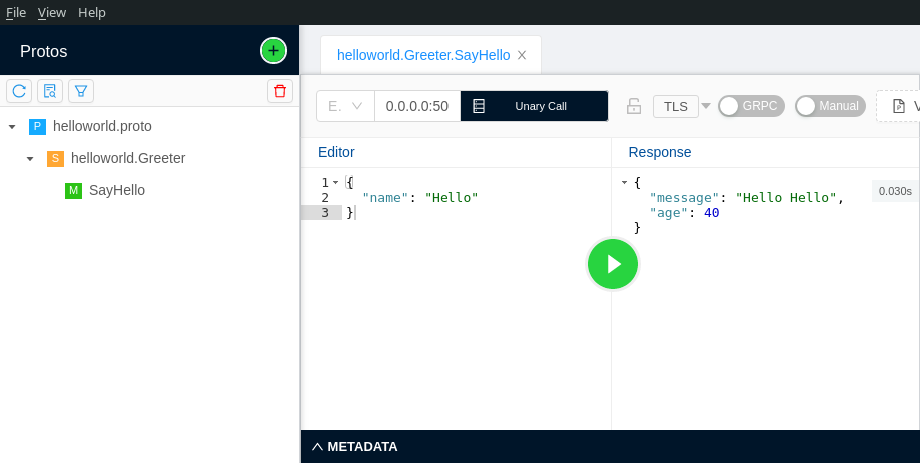

# First NodeJS `gRPC`

A example repository to show how you can create your first gRPC webservice (+ Protobuf in HTTP2 protocol) with NodeJS.

## What you already need to know before this repository

- **HTTP/2:** HTTP/2 (or h2) is a binary protocol that brings push, multiplexing streams and frame control to the web.
- **Protobuf:** Protocol Buffers (a.k.a., protobuf) are Google's language-neutral, platform-neutral, extensible mechanism for serializing structured data. Protobuf is an Interface Definition Language that is language-neutral and platform-neutral. ... With protobuf, you define your message format in a `.proto` file. You can then use the protobuf compilers to generate the client and service side code to encode and parse the data.
- **gRPC:** `gRPC` is a modern open source high performance Remote Procedure Call (RPC) framework that can run in any environment. It can efficiently connect services in and ...

## Getting started

```
sudo npm install -g grpc-tools
grpc_tools_node_protoc --js_out=import_style=commonjs,binary:. --grpc_out=grpc_js:. helloworld.proto
```

### Start the server

```
node server.js
```

### Start the client to test

```
node client.js
```

#### Test with playground software (BloomRPC)



## Structure

Protobuf structure:

```
message HelloRequest {
  string name = 1;
}

message HelloReply {
  string message = 1;
  int32 age = 2;
}
```
### Connect gRPC to Nginx

```
server {
      listen 94 http2;
      location / {
          # Replace localhost:50051 with the address and port of your gRPC server
          # The 'grpc://' prefix is optional; unencrypted gRPC is the default
          grpc_pass grpc://localhost:50051;
      }
  }
```

And restart nginx:

```
sudo systemctl restart nginx
```

Read more: https://www.nginx.com/blog/nginx-1-13-10-grpc/
    
### Benchmark Performance

Using https://ghz.sh/:
```
$ ghz --insecure --proto ./helloworld.proto --call helloworld.Greeter.SayHello -d '{"name":"Max"}' 0.0.0.0:50051

Summary:
  Count:	200
  Total:	35.95 ms
  Slowest:	13.22 ms
  Fastest:	2.34 ms
  Average:	8.63 ms
  Requests/sec:	5562.82

Response time histogram:
  2.337 [1]	|∎
  3.426 [26]	|∎∎∎∎∎∎∎∎∎∎∎∎∎∎∎∎∎∎∎∎∎∎∎∎∎
  4.514 [0]	|
  5.602 [6]	|∎∎∎∎∎∎
  6.691 [19]	|∎∎∎∎∎∎∎∎∎∎∎∎∎∎∎∎∎∎∎
  7.779 [31]	|∎∎∎∎∎∎∎∎∎∎∎∎∎∎∎∎∎∎∎∎∎∎∎∎∎∎∎∎∎∎
  8.868 [40]	|∎∎∎∎∎∎∎∎∎∎∎∎∎∎∎∎∎∎∎∎∎∎∎∎∎∎∎∎∎∎∎∎∎∎∎∎∎∎∎
  9.956 [0]	|
  11.044 [10]	|∎∎∎∎∎∎∎∎∎∎
  12.133 [26]	|∎∎∎∎∎∎∎∎∎∎∎∎∎∎∎∎∎∎∎∎∎∎∎∎∎
  13.221 [41]	|∎∎∎∎∎∎∎∎∎∎∎∎∎∎∎∎∎∎∎∎∎∎∎∎∎∎∎∎∎∎∎∎∎∎∎∎∎∎∎∎

Latency distribution:
  10 % in 2.88 ms 
  25 % in 5.73 ms 
  50 % in 8.42 ms 
  75 % in 11.98 ms 
  90 % in 13.06 ms 
  95 % in 13.16 ms 
  99 % in 13.20 ms 

Status code distribution:
  [OK]   200 responses   
```

**Minimum:**
```
Average:	16.03 ms
Requests/sec:	3062.49
```

**Maximum:**
```
Average:	8.63 ms
Requests/sec:	5562.82
```

**Minimum with Nginx:**
```
Average:	26.05 ms
Requests/sec:	1870.37
```

**Maximum with Nginx:**
```
Average:	10.59 ms
Requests/sec:	4606.05
```

**Note:** These tests were not performed under specific and appropriate conditions. It is better to try it yourself.

### Hardware

- **CPU:** Intel Core i5-9400F @ 6x 4.1GHz [52.0°C]
- **Node:** v13.14.0
- **NPM:** 6.14.4

**Read more:**
- https://grpc.io/docs/languages/node/
- https://developers.google.com/protocol-buffers
- https://developers.google.com/web/fundamentals/performance/http2
- https://http2.github.io/
- https://imagekit.io/demo/http2-vs-http1
- https://grpc.io/docs/languages/node/quickstart/
- https://ghz.sh/docs/usage

© Copyright Max Base, 2021
